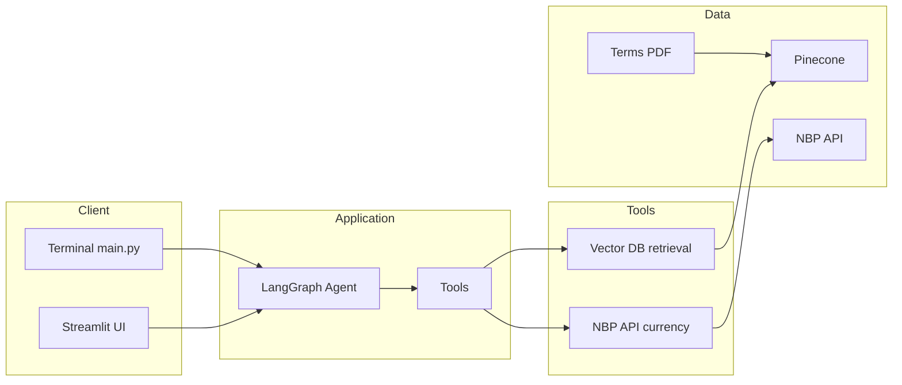

# Nexus Bank Virtual Assistant

A RAG-powered conversational AI for **Nexus Bank S.A.** (fictional Polish bank). It answers retail clients’ questions about accounts, fees, interest rates, and currency exchange using the bank’s Terms and Conditions (PDF) and live NBP exchange rates.

---

## Motivation

- **Why this use case?** Banks receive large volumes of repetitive questions (account types, fees, ATM costs, exchange rates). A virtual assistant can handle these 24/7 without involving call centre staff, while staying within strict compliance rules.
- **What problem does it solve?** Clients get **accurate, up-to-date answers** from the official Terms (via RAG) and **current FX rates** (via NBP API), with **no financial advice**, **no collection of passwords/PINs**, and **no access to account balances**. The assistant directs users to support when needed and applies the bank’s mandatory 2.50 PLN FX commission transparently.

---

## Features Implemented

- **RAG (Retrieval-Augmented Generation)** — Vector store (Pinecone) over the official *General Terms and Conditions of Retail Banking Services of Nexus Bank S.A.* (PDF). Answers are grounded in retrieved chunks.
- **Currency exchange tool** — Fetches current average exchange rates from the National Bank of Poland (NBP) API (PLN ↔ EUR, USD, GBP, CHF, etc.) and applies the 2.50 PLN commission from the Terms.
- **Compliant behaviour** — No financial advice; no handling of passwords/PINs; no access to account balances; suggests contacting support when appropriate.
- **Dual interface** — Terminal chat (`main.py`) and web UI (Streamlit) with streamed replies in the user’s language.
- **Model choice (Streamlit)** — OpenAI GPT-5 Mini or Ollama (Llama 3.2 3B).
- **Per-session conversations** — Each Streamlit session and each CLI run has its own conversation thread (isolated history and LangGraph checkpointer state).
- **Optional observability (Langfuse)** — When `LANGFUSE_SECRET_KEY` and `LANGFUSE_PUBLIC_KEY` are set, all agent runs (Streamlit and CLI) are traced to Langfuse with session grouping for debugging and analytics.
- **RAG evaluation** — Optional RAGAS-based evaluation (Faithfulness, Factual Correctness, Context Recall, Context Precision) in `ragas_eval.py`.

---

## Architecture

User input is handled by either the terminal or the Streamlit app. The LangGraph agent decides which tools to call (vector DB retrieval and/or NBP currency API), then the LLM produces a response grounded in the retrieved context and tool results.



---

## Tech Stack

| Layer | Technology |
|-------|------------|
| **LLM** | OpenAI (gpt-5-mini); optionally Ollama (llama3.2:3b) |
| **Embedding** | OpenAI `text-embedding-3-small` |
| **Vector DB** | Pinecone (index `codecademy-assesment`, ServerlessSpec) |
| **Framework** | LangChain, LangGraph (agent + checkpointer), LangChain-OpenAI, LangChain-Ollama, LangChain-Pinecone |
| **App** | Python 3, Streamlit (web), PyPDFLoader, RecursiveCharacterTextSplitter |
| **Observability** | Langfuse (optional; tracing, sessions, cost/latency when API keys set) |
| **Evaluation** | RAGAS (Faithfulness, Factual Correctness, Context Recall, Context Precision) |
| **Environment** | python-dotenv; NBP API (no key required) |

---

## Installation & Quick Start

Assume a working Python 3 environment (e.g. 3.10+).

### 1. Clone and enter the project

```bash
git clone <repository-url>
cd Assesment
```

### 2. Virtual environment and dependencies

```bash
python -m venv .venv
source .venv/bin/activate   # On Windows: .venv\Scripts\activate
pip install -r requirements.txt
```

### 3. Environment variables

Copy `.env.example` to `.env` and fill in the values:

```bash
cp .env.example .env
```

Required:

- **OPENAI_API_KEY** — For the chat model and embeddings.
- **PINECONE_API_KEY** — For RAG; the app uses or creates the index `codecademy-assesment` on first run.

Optional:

- **Langfuse** — For observability (traces, sessions, token/cost). Set `LANGFUSE_SECRET_KEY`, `LANGFUSE_PUBLIC_KEY`, and `LANGFUSE_HOST` (e.g. `https://cloud.langfuse.com` for EU or `https://us.cloud.langfuse.com` for US). Get keys in Langfuse → Settings → API Keys. If unset, the app runs without tracing.
- **Ollama** — To use Ollama in the Streamlit UI, run Ollama locally with the model `llama3.2:3b`.

### 4. Run locally

**Terminal chat:**

```bash
python main.py
```

Type your questions at the prompt; use `exit`, `q`, or `quit` to end the session.

**Web UI (Streamlit):**

```bash
streamlit run streamlit_app.py
```

Open the URL shown in the terminal (e.g. http://localhost:8501). You can switch between OpenAI and Ollama in the sidebar.

On first run, the PDF is loaded, chunked, embedded, and uploaded to Pinecone; this may take a short time.

**Observability (Langfuse):**  
If `LANGFUSE_SECRET_KEY` and `LANGFUSE_PUBLIC_KEY` are set in `.env`, every agent run (Streamlit and CLI) is traced to your Langfuse project. In Langfuse you can inspect traces, sessions (grouped by conversation), token usage, and latency. No code changes are required; tracing is disabled when the keys are missing.

**RAG evaluation (RAGAS):**

Run the RAGAS evaluation script (Faithfulness, Factual Correctness, Context Recall, Context Precision) with:

```bash
python ragas_eval.py
```

Ensure `.env` with `OPENAI_API_KEY` and `PINECONE_API_KEY` is set; the script builds the evaluation dataset from the predefined queries, runs the agent, and prints the scores.

---

## Docker

You can run the app in a container. Ensure you have [Docker](https://docs.docker.com/get-docker/) installed.

### Build the image

From the project root:

```bash
docker build -t nexus-assistant .
```

### Run the container

Pass your environment variables via an env file (do not commit `.env`):

```bash
docker run -p 8501:8501 --env-file .env nexus-assistant
```

Open http://localhost:8501 for the Streamlit UI. Use `Ctrl+C` to stop the container.

The Dockerfile uses `python:3.12-slim`, installs dependencies from `requirements.txt`, and runs Streamlit on port 8501 with `--server.address=0.0.0.0` so the app is reachable from the host. A `.dockerignore` file excludes `.venv`, `.env`, `__pycache__`, and `.git` from the build context.

---

## Deploy on Railway

This project can be deployed on [Railway](https://railway.app/) with minimal configuration.

1. **Create a Railway account** at [railway.app](https://railway.app) and install the GitHub integration if you want to deploy from a repository.

2. **New Project → Deploy from GitHub repo** (or use Railway CLI). Select this repository and the branch to deploy. Railway will detect the Dockerfile and build the image.

3. **Set environment variables** in the Railway dashboard: **Project → Variables** (or **Service → Variables**). Add:
   - `OPENAI_API_KEY` — your OpenAI API key
   - `PINECONE_API_KEY` — your Pinecone API key  
   Optionally, for **Langfuse** tracing: `LANGFUSE_SECRET_KEY`, `LANGFUSE_PUBLIC_KEY`, and `LANGFUSE_HOST` (e.g. `https://cloud.langfuse.com`).

4. **Deploy.** Railway will build the container, run it, and assign a public URL (e.g. `https://nexus-bank-virtual-assistant-production.up.railway.app/`). The Streamlit app will be available at that URL.

5. **Optional:** In **Settings**, you can set a custom domain or configure the public port if needed (default is 8501).

No credit card is required for the free tier; usage limits apply. See [Railway docs](https://docs.railway.app/) for more details.

---

## Project Structure

```
Assesment/
├── main.py              # Entry point: terminal chat loop (with Langfuse flush on exit)
├── streamlit_app.py     # Streamlit web UI
├── ragas_eval.py        # RAGAS evaluation (Faithfulness, etc.)
├── app/
│   ├── __init__.py
│   ├── agent.py         # Agent definition, system prompt, LLM(s)
│   ├── chat_utils.py    # Streaming response helper; wires Langfuse callbacks when configured
│   ├── langfuse_config.py  # Optional Langfuse callback and metadata; flush() for CLI
│   ├── tools.py         # check_currency_rate, retrieve_from_vector_db
│   └── vector_db.py     # PDF loader, splitter, Pinecone init
├── data/
│   └── Nexus Bank Terms and Conditions.pdf
├── .env.example         # Template for OPENAI_API_KEY, PINECONE_API_KEY, optional Langfuse
├── Dockerfile
├── .dockerignore
├── requirements.txt
└── README.md
```

---

## Example Queries & Outputs

**Query 1: Account types**

```
What are the account types offered by Nexus Bank?
```

**Output (excerpt):**

```
Nexus Bank offers three main account types for retail clients:

- **Standard Account** — …
- **Premium Account** — …
- **Savings Plus** — …

For full details on fees and conditions, please refer to the Terms and Conditions or contact Customer Support.
```

---

**Query 2: Foreign ATM fee (Standard Account)**

```
How much does it cost to withdraw cash from a foreign ATM with a Standard Account?
```

**Output (excerpt):**

```
For a Standard Account, a withdrawal at a foreign ATM incurs:

1. **ATM fee:** 15.00 PLN (as per Nexus Bank Terms and Conditions).
2. **FX commission:** 2.50 PLN per foreign exchange transaction.

The conversion from the local currency (e.g. EUR) to PLN uses the current NBP average rate. For the exact rate applicable at the time of your transaction, you can ask for the current EUR (or other currency) rate. Your total cost will be 15.00 PLN + 2.50 PLN plus the converted amount at the NBP rate.
```

---

**Query 3: Current EUR rate and cost to buy 100 EUR**

```
What is the current EUR exchange rate? How much would 100 EUR cost me in PLN?
```

**Output (excerpt):**

```
The current NBP average rate for EUR is [X.XXXX] PLN per 1 EUR.

For 100 EUR:

- Conversion: 100 × [X.XXXX] = [XXX.XX] PLN
- Bank commission (per Terms): 2.50 PLN
- **Total: [XXX.XX] + 2.50 = [XXX.XX] PLN**

Exact amounts may vary slightly depending on the time of execution. I am an informational assistant and do not advise on timing of currency purchases.
```

---

## Limitations & Future Improvements

**Limitations**

- Fictional bank and Terms; not for real banking or financial decisions.
- Single document (Terms PDF); no other sources (e.g. FAQ, product sheets).
- Pinecone is cloud-based; requires an account and API key.
- RAG evaluation (RAGAS) is a separate script (`ragas_eval.py`), not integrated into the main app.

**Future improvements**

- Add more documents or sources to RAG (FAQ, product descriptions).
- Optional user authentication and demo “balance” for sandbox use.
- Integrate RAGAS into CI or a scheduled job for periodic evaluation reports.
- Support a local vector store (e.g. Chroma) as an alternative to Pinecone.

---

## References

- [LangChain Documentation](https://python.langchain.com/)
- [LangGraph](https://langchain-ai.github.io/langgraph/)
- [OpenAI API](https://platform.openai.com/docs)
- [Pinecone](https://docs.pinecone.io/)
- [NBP API](http://api.nbp.pl/) — National Bank of Poland exchange rates (no API key).
- [RAGAS](https://docs.ragas.io/) — Evaluation for RAG pipelines.
- [Langfuse](https://langfuse.com/docs) — Observability and tracing for LLM applications.
